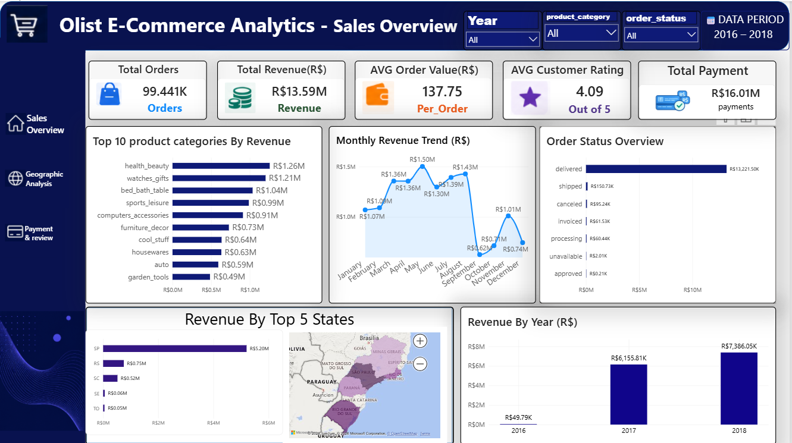
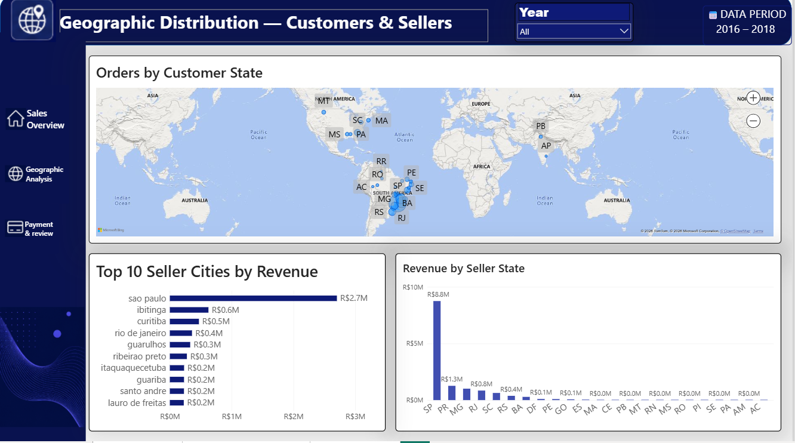
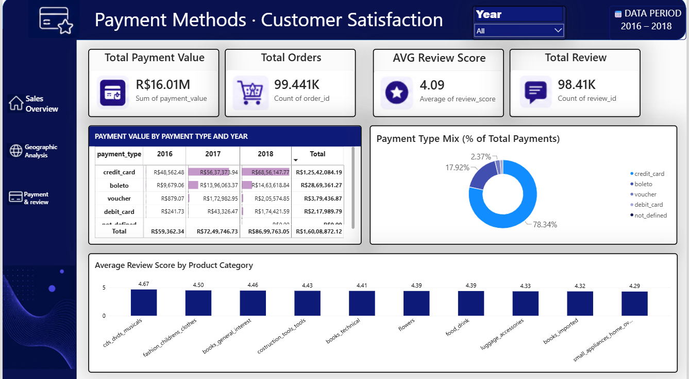

# 🛒 Olist Brazilian E-Commerce Analytics Dashboard

An interactive **Power BI Dashboard** built using the **Olist Brazilian E-Commerce Dataset** to analyze sales performance, customer behavior, geographic distribution, payment methods, and customer satisfaction. The dashboard helps transform raw e-commerce data into meaningful business insights for better decision-making.

---

# 📌 Project Overview

This project analyzes Olist's Brazilian E-Commerce dataset (2016–2018) using Microsoft Power BI. The dashboard is divided into three interactive pages that provide a complete overview of sales performance, customer and seller distribution, payment methods, and customer reviews.

The report includes interactive filters, KPI cards, maps, bar charts, line charts, donut charts, and tables to help users explore the data efficiently.

---

# 🎯 Project Objectives

- Analyze overall sales performance.
- Track total orders, revenue, and payments.
- Identify top-performing product categories.
- Analyze customer and seller distribution.
- Monitor monthly revenue trends.
- Understand payment methods used by customers.
- Measure customer satisfaction using review scores.
- Create an interactive dashboard for business analysis.

---

# 🛠️ Tools Used

- Microsoft Power BI
- Power Query
- Microsoft Excel / CSV Dataset
- Data Modeling
- Interactive Visualizations

---

# 📊 Dashboard Pages

## 🏠 Page 1 – Sales Overview

This page provides an overview of business performance using KPI cards and interactive charts.

### Key KPIs

- Total Orders
- Total Revenue
- Average Order Value
- Average Customer Rating
- Total Payment

### Visualizations

- Top 10 Product Categories by Revenue
- Monthly Revenue Trend
- Order Status Overview
- Revenue by Top 5 States
- Revenue by Year

### Business Insights

- Identify top-performing product categories.
- Compare yearly revenue growth.
- Analyze monthly revenue trends.
- Monitor order status.
- Compare revenue across different states.

### Dashboard Page 1



---

## 🌎 Page 2 – Geographic Analysis

This page analyzes customer and seller distribution across Brazil.

### Visualizations

- Orders by Customer State (Map)
- Top 10 Seller Cities by Revenue
- Revenue by Seller State

### Business Insights

- Identify regions with the highest customer orders.
- Compare seller performance across states.
- Understand geographical sales distribution.

### Dashboard Page 2



---

## 💳 Page 3 – Payment & Customer Satisfaction

This page focuses on payment analysis and customer review performance.

### Key KPIs

- Total Payment Value
- Total Orders
- Average Review Score
- Total Reviews

### Visualizations

- Payment Value by Payment Type and Year
- Payment Type Mix
- Average Review Score by Product Category

### Business Insights

- Understand customer payment preferences.
- Compare payment value over different years.
- Measure customer satisfaction across product categories.
- Analyze review scores to improve customer experience.

  ### Dashboard Page 3



---

# 📈 Dashboard Features

- Interactive KPI Cards
- Year Filter
- Product Category Filter
- Order Status Filter
- Interactive Maps
- Line Charts
- Bar Charts
- Donut Charts
- Tables
- Cross Filtering

---

# 💡 Key Insights

- Revenue increased significantly between 2016 and 2018.
- Credit Card is the most preferred payment method.
- São Paulo generates the highest revenue.
- Health & Beauty is the top-performing product category.
- Customer review scores remain consistently above 4 out of 5.
- Monthly revenue trends help identify seasonal sales patterns.

---

# 📂 Repository Structure

```text
Olist-Brazilian-Ecommerce-Analysis-PowerBI/
│
├── PR.3.pbix
├── README.md
├── Dashboard-page-1.png
├── Dashboard-page-2.png
└── Dashboard-page-3.png
```

---

# 🚀 How to Use

1. Download the Power BI (.pbix) file.
2. Open it using Microsoft Power BI Desktop.
3. Explore each dashboard page.
4. Use the Year, Product Category, and Order Status filters.
5. Interact with charts to gain business insights.

---

# 📚 Skills Demonstrated

- Power BI
- Power Query
- Data Cleaning
- Data Transformation
- Data Modeling
- Data Visualization
- Dashboard Design
- Business Intelligence

---

# 👩‍💻 Author

## Sakshi Bagul

Aspiring Data Analyst

### Skills

- Microsoft Power BI
- SQL
- Python
- Excel
- Power Query
- Data Visualization

---

# 📌 Conclusion

This Power BI project demonstrates how e-commerce data can be transformed into meaningful business insights using interactive dashboards. The report helps analyze sales performance, customer behavior, seller performance, payment methods, and customer satisfaction, enabling data-driven business decisions.

---

⭐ If you found this project helpful, consider giving it a **Star** on GitHub.
